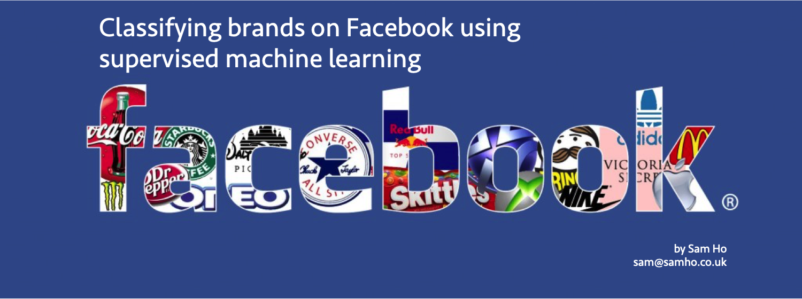

# Goals of the project
Focussing on the seven biggest UK supermarket brands on Facebook and using natural language processing with supervised classification modelling, can we train a machine to classify supermarket brands?

# Why you created the project
Facebook pages are a significant brand asset for thousands of companies and organisations worldwide. Companies invest heavily in developing social content in order to engage with customers and prospects in a two way 'conversation’. 

The impact of social media on business success is widely debated however one thing that most marketers agree on is that brand differentiation is a key aspect of any 'healthy' brand. Brands need to stand out from one another in their category. Not just in terms of what they offer but also in terms of how they communicate - across all media channels, including social media. Which leads to the marketing focus of this project: 

<b>Are brands doing enough to differentiate their social content on Facebook?</b>

## Why supermarkets?
There are a few reasons why UK supermarkets felt like a good area to investigate. Firstly, the UK supermarket is something everyone will experience at least once a week or more often. Furthermore we have a good spread of brand positioning in the UK supermarket category with both premium and budget brands actively delivering a service to people up and down the country. Finally, the UK supermarket category is [worth hundreds of billions of pounds](https://www.statista.com/statistics/295669/grocery-retail-market-value-by-in-the-united-kingdom-uk/) so there was a modicum of commerical pertinence in making UK supermarket brands the focus for this project.

# Methodology & Approach

Seven of the UK's leading supermarket brands were chosen for the study: Sainsbury's, Tesco, Lidl, ASDA, Morrisons, M&S and Waitrose. I web scraped the brands' posts from Facebook using automation (Selenium). Although there is some variance, we have at least two years of Facebook content for each brand. The data was loosely stuctured after scraping however required further cleaning and preparation in order to make the Facebook content viable for modelling.

# Findings & Overview
For those that are more technically minded that want an overview of the project - from its inception to the results - I would recommend exploring the [Summary & Technical Report](https://github.com/kitsamho/General-Assembly_DSI-Capstone-Project/blob/master/0_Summary%20%26%20Technical%20Reporting/Summary%20%26%20Technical%20Reporting.ipynb), for those who want something less technical and more visual - I have created a [pdf deck](https://github.com/kitsamho/General-Assembly_DSI-Capstone-Project/blob/master/6_Presentation/Capstone%20Deck.pdf) talking through the project in a more accessible manner. 

# The detail : links to specific stages of the project

The project in its current state splits into a six stages and for ease of reading I’ve split this across six notebooks. 

[Final_Clean_Data](https://github.com/kitsamho/General-Assembly_DSI-Capstone-Project/tree/master/0_Final_Clean_Data)

[Summary & Technical Reporting](https://github.com/kitsamho/General-Assembly_DSI-Capstone-Project/blob/master/0_Summary%20%26%20Technical%20Reporting/Summary%20%26%20Technical%20Reporting.ipynb)

[1_Data Acquisition](https://github.com/kitsamho/General-Assembly_DSI-Capstone-Project/blob/master/1_Data%20Acquisition/1_Data%20Acquisition.ipynb)

[2_Data Preparation & Cleaning](https://github.com/kitsamho/General-Assembly_DSI-Capstone-Project/tree/master/2_Data%20Preparation%20%26%20Cleaning)

[3_Feature Engineering](https://github.com/kitsamho/General-Assembly_DSI-Capstone-Project/tree/master/3_Feature%20Engineering)

[4_EDA](https://github.com/kitsamho/General-Assembly_DSI-Capstone-Project/tree/master/4_EDA)

[5_Modelling](https://github.com/kitsamho/General-Assembly_DSI-Capstone-Project/tree/master/5_Modelling)

[6_Presentation](https://github.com/kitsamho/General-Assembly_DSI-Capstone-Project/tree/master/6_Presentation)

# How to install the project

Feel free to fork and clone this project. You’ll need a github account and a python environment to run the code, Jupyter notebook might make sense seeing as that’s what I wrote in.

Some key libraries are required in order to run this project in its entirety:

- Selenium
- Chromedriver / Webdriver
- TQDM Notebook (not essential, but helps to see progress)
- All the standard Data Science libraries (e.g. SKLearn, Seaborn, Pandas, NumPy...)

# How to run the project
I've set up each stage of the project in its own folder with various sub folder containing all the data you need, so you can download individual folders and run them seperately and (hopefully) they should all run smoothly. If you have any problems though, let me know through here and I can try and assist you.

# Observations and improvements
There are plenty of improvements I can make to this project which are outlined in the technical report [here](https://github.com/kitsamho/General-Assembly_DSI-Capstone-Project/blob/master/0_Summary%20%26%20Technical%20Reporting/Summary%20%26%20Technical%20Reporting.ipynb) however I'll include them below again for convenience.

## Approach:
Scraping data from Facebook was 'interesting' to say the least, and presented many challenges. As Selenium mimicks the web navigating behaviour of an individual, scraping can be a slow process, taking up to a few hours just to gather content for one brand. Furthermore, sometimes the way pages load on Facebook can vary meaning that some syntax failed to work. Although I managed to write a script that got what I needed fairly consistently - repeating this data capture process again for other brands / other categories could be a slow process.

Futhermore, obtaining some metrics was very difficult i.e the breakdown of wether a post received like, haha, angry, sad, wow etc. I subsequently aggregated them all together. This is ok given that I felt classification wouldn't require these as features - but we lose the detail for EDA and if we were to do further modelling.

## Data - more of it in terms of volume:
Although we had reasonable amounts of data more content would be helpful in making our model more robust and possibly improve its accuracy. My hands are somewhat tied however; because brands rarely post more than one post a day, in any given year you're looking at about c.300 posts available, less in some instances. Therefore if we want n=10K rows, we need to scrape back many, many years. As mentioned above, the scraping process was very slow so therefore obtaining greater volumes of data in an efficient manner could be tricky. Furthemore, some brands have only had a presence on Facebook for a handful of years.

## Data - more of it in terms of granularity:
Although my Selenium script allowed me to obtain my primary data source - I did use a secondary data source [Fanpage Karma](https://www.fanpagekarma.com) to provide me with time stamped 'total likes' data which I integrated with my intial data set. I subscribed to their free trial and took what I needed. However when I was exploring this source, there were many other useful metrics that I would have access to - such as the break out of like, haha, angry, sad, wow etc. This secondary data source could very well plug the gaps found in my primary data source so I would be happy to look into this in any future iterations of this project and see where I can synergise different data sets further. This would be particularly useful if I wanted to do any linear regressiom modelling e.g. predicting what kinds of posts result in more 'likes'.

## NLP Approaches:
Although TF-IFD Vectorisation was successul in highlighting the differences in the posts and was a much better approach than a simple bag of words model (Count Vectorising), using TF-IFD, we are still effectively using word counts in some form (although weighted) to provide features. It would be interesting - volume of text data permitting - to explore more nuanced ways of text analysis that can give us 'richer' features e.g sentiment analysis (using something like VADER) and exploring topics and themes (using something like LDA).

# Link to Jupyter Notebook

The link to all the notebooks is [here](https://github.com/kitsamho/General-Assembly_DSI-Capstone-Project)

# Link to final and cleaned data set

The link to the final clean data is [here](https://github.com/kitsamho/General-Assembly_DSI-Capstone-Project/tree/master/0_Final_Clean_Data)
